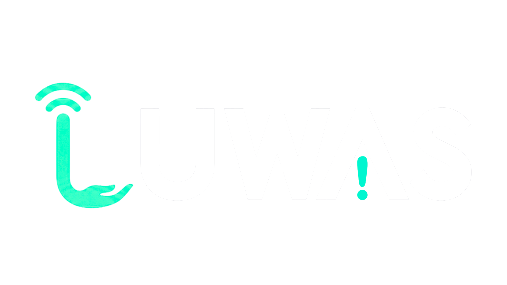

<div align="center">




### Post-disaster logistics coordination for NGO field teams

*Find the silent barangays. Estimate who's affected. Manifest the supplies. Route real roads. Keep a human in command.*

**ASEAN AI Hackathon 2026 &middot; Team CIT-U Shane-nanigans**

[](web/)
[](web/)
[](supabase/)
[](ai-services/)
[](docs/DEPLOY.md)
[](LICENSE)

**Pilot region: Cebu, Philippines** &middot; Climate-adaptation focus: intensifying typhoons

[**For Judges**](#for-hackathon-judges) &middot;
[**Quickstart**](#collaborator-quickstart) &middot;
[**Local Setup**](#local-setup) &middot;
[**Docs**](#documentation-map)

</div>

---

## The problem

After a major typhoon, the barangays in the most trouble are often the ones you **stop hearing
from** — power and cell towers are down, and silence reads as "fine" when it usually means the
opposite. Coordinators triage dozens of incoming reports by hand, guess at affected numbers, and
route trucks on map distances that ignore washed-out roads.

## What LUWAS does

LUWAS turns scattered volunteer field reports into a **reviewable dispatch plan**. Every step is
assistive — the coordinator can override every prediction, manifest, and route.

```text
  field reports  (SMS / volunteer PWA, works offline)
        |
        v
  Supabase (PostGIS) ──▶ Silent-Area score   who went quiet, hazard-weighted (pg_cron, /15 min)
        |
        v
  TabPFN impact ──▶ Sphere manifest ──▶ OR-Tools route ──▶ MapLibre map
   affected &        15 L water/person/day   real pgRouting     coordinator
   severity          2,100 kcal/person/day   road matrix        dispatch board
   (assistive)
```

| Coordinators can… | How |
| --- | --- |
| Collect field reports | Volunteer PWA (offline-first) + inbound SMS webhook |
| Surface silent / high-risk barangays | PostGIS `silent_area_score()`, hazard-weighted, on a 15-min cron |
| Estimate affected population & severity | TabPFN v2 — **assistive**, with a deterministic fallback |
| Generate transparent supply manifests | Deterministic Sphere formula (no black box) |
| Route teams on real roads | OR-Tools over a pgRouting distance matrix — **never** Euclidean |
| Stay in control | Every AI output is overridable and attributed |

---

## For hackathon judges

**Start here — the fastest way to understand LUWAS:**

1. **Read [`CLAUDE.md`](CLAUDE.md)** (~2 min) — the one-page architecture and data-flow primer.
2. **Skim [`docs/DEPLOY.md`](docs/DEPLOY.md)** — the live `POST /api/pipeline` orchestration, step
   by step, that ties the whole system together.
3. **Try the live impact model** — already deployed, no setup:
   [`huggingface.co/spaces/jrvnryle/luwas`](https://huggingface.co/spaces/jrvnryle/luwas)
   (`GET /health`, then `POST /predict-impact`).
4. **Run the app locally** — see [Collaborator Quickstart](#collaborator-quickstart); the shared
   Supabase project and AI Space are already live, so it's two commands.

**What we want you to notice:**

- **Honest by design.** Every AI output is labeled assistive and is overridable. The deterministic
  core (Silent-Area scoring, Sphere manifests, real-road routing) is **visible SQL and formulas**,
  not a model you have to trust blindly.
- **Real geospatial, free-tier only.** PostGIS + pgRouting on actual Cebu OSM roads and Project
  NOAH hazard layers — scoped to fit Supabase / Vercel / Hugging Face free tiers.
- **Built for the disaster reality.** Offline-first PWA with Background Sync, plus an SMS path for
  when only text gets through.
- **SEA-first NLP.** Field reports parse in Filipino, Bisaya, and Tagalog via SEA-LION (Gemini
  fallback).
- **Tested.** Engine-level test suites across the web app and AI services, with stated acceptance
  criteria. End-to-end coordinator-dispatch and offline-sync flows are covered.

**The deeper story (for the "is this credible?" question):**

| Question | Where it's answered |
| --- | --- |
| How good is the impact model, really? | [`docs/MODEL_CARD.md`](docs/MODEL_CARD.md) + [`docs/impact_validation_results.md`](docs/impact_validation_results.md) |
| Does it treat vulnerable groups fairly? | [`docs/FAIRNESS.md`](docs/FAIRNESS.md) |
| How is the human kept in the loop? | [`docs/ETHICS.md`](docs/ETHICS.md) |
| How is volunteer PII protected? | [`docs/PRIVACY.md`](docs/PRIVACY.md) |
| What's built vs. honestly deferred? | [`docs/ROADMAP.md`](docs/ROADMAP.md) |

---

## Tech stack

| Area | Technology | Purpose |
| --- | --- | --- |
| Frontend | Next.js 16 App Router, TypeScript, Tailwind CSS | Coordinator dashboard and volunteer app |
| Maps | MapLibre GL JS | Barangay pins, road routes, and team tracking |
| Offline support | Workbox | PWA caching and queued volunteer reports |
| Auth & database | Supabase | Authentication, Postgres database, Realtime updates |
| Geospatial database | PostGIS, pgRouting, pg_cron | Spatial queries, road routing, scheduled scoring |
| Backend services | Python FastAPI | AI and optimization service endpoints |
| Impact prediction | TabPFN v2 | Assistive affected-population & severity prediction |
| Routing | OR-Tools | Multi-team vehicle routing on real roads |
| NLP parsing | SEA-LION (Gemini fallback) | Parse Filipino, Bisaya, and Tagalog field reports |
| Supply logic | Deterministic Sphere formula | 15 L water/person/day · 2,100 kcal/person/day |
| Deployment | Vercel · Hugging Face Spaces · Supabase | Free-tier demo deployment |

---

## Team — CIT-U Shane-nanigans

| Avatar | Name | Role | Program | GitHub |
| --- | --- | --- | --- | --- |
|  | Lovely Shane P. Ong | Leader | BSCS | [@xienshane](https://github.com/xienshane) |
|  | Jervin Ryle I. Milleza | Member | BSCS | [@jermochi](https://github.com/jermochi) |
|  | James O. Ewican | Member | BSCS | [@jewican](https://github.com/jewican) |
|  | Sydney B. Galorio | Member | BSCS | [@Shizune-23](https://github.com/Shizune-23) |
| N/A | Jireh C. Cañedo | Member | BSBA | N/A |

---

## Repository structure

```text
luwas-asean-hackathon/
├── CLAUDE.md          # Project context primer. Read this first.
├── README.md          # You are here — onboarding, setup, judge's guide.
├── .env.example       # Environment variable catalog (copy the block you need).
├── web/               # Next.js 16 App Router app → Vercel.
├── ai-services/       # Python FastAPI AI/optimization services → Hugging Face Space.
├── supabase/          # Database as code.
│   ├── migrations/    # Schema, PostGIS, pgRouting edge table, RLS.
│   ├── functions/     # SQL: silent_area_score(), dynamic edge updates.
│   └── seed/          # Demo Cebu data.
├── data-pipeline/     # One-off ETL / import / validation scripts (not deployed).
└── docs/              # Deploy notes, model card, fairness, ethics, privacy, roadmap.
```

> **Organized by deploy target, not by monorepo tooling.** One JS app (`web/`), one FastAPI
> Space (`ai-services/`), database-as-code (`supabase/`), and local-only ETL (`data-pipeline/`).
> Plain folders, no Turborepo/Nx — see [`CLAUDE.md`](CLAUDE.md) for the structural rationale.

---

## Collaborator Quickstart

We all share **one Supabase project** (already set up and loaded with data), and the AI impact
service is **already deployed** to a Hugging Face Space — so there's no backend to configure. To
get a working app running locally:

1. **Clone** the repo (you also get the committed datasets).
2. **Ask the team for the real `.env` values** and create `web/.env.local` — the `.env.example`
   files are blank templates; secrets are never committed.
3. **Run the web app:**

   ```bash
   npm --prefix web install
   npm --prefix web run dev   # http://localhost:3000
   ```

You now have a working app on the shared database. Building the Python services or the data
pipeline instead? See **[Local Setup](#local-setup)** below.

---

## Local Setup

### Prerequisites

- **Node.js 20+** and npm (web app)
- **Python 3.12** (`data-pipeline/` ETL and `ai-services/`)
- A **Supabase project** with `postgis`, `pgrouting`, and `pg_cron` enabled and the core tables
  created

### Environment variables

Each deployable reads its own env file. Copy the matching block from [`.env.example`](.env.example)
and fill in real values only on your machine or the deployment dashboard — **never commit
secrets**.

| File | Block | Used by |
| --- | --- | --- |
| `.env.local` (repo root) | `DATABASE_URL` | `data-pipeline/` scripts, Supabase tooling |
| `web/.env.local` | `web` | Next.js app |
| `ai-services/.env` | `ai-services` | FastAPI services |

For `DATABASE_URL`, use the Supabase **IPv4 session pooler** string
(`aws-0-<region>.pooler.supabase.com:5432`), not the direct `db.<ref>.supabase.co` host
(IPv6-only — the ingestion script will tell you to switch if it can't connect).

### Web app

```bash
npm --prefix web install
npm --prefix web run dev   # http://localhost:3000
```

#### Volunteer PWA + SMS demo

The volunteer app at `/volunteer` is an installable PWA. The service worker only runs in
production builds: `npm --prefix web run build && npm --prefix web run start`, then test offline
submissions via DevTools → Network → Offline (reports queue with Background Sync and upload on
reconnect, flagged `offline_synced` for coordinators).

Web env additions (see `.env.example`): `SUPABASE_SERVICE_ROLE_KEY` (SMS webhook inserts) and
`SMS_WEBHOOK_SECRET` (webhook auth token).

Simulate an inbound SMS (no shortcode needed — `/api/sms/mock` wraps the text in a Semaphore-style
payload and runs the real `/api/sms` pipeline: SEA-LION parse → barangay geocode → `field_reports`
insert → realtime map pin):

```bash
curl -X POST "http://localhost:3000/api/sms/mock?token=$SMS_WEBHOOK_SECRET" \
  -H 'Content-Type: application/json' \
  -d '{"message":"LUWAS: grabe ang baha sa Guadalupe, mga 80 ka pamilya ang apektado"}'
```

> The mock endpoint is demo-only: it 404s in production unless `ENABLE_SMS_MOCK=true`.

Volunteer live tracking: toggle "Share my location with HQ" on `/volunteer` (records consent),
then watch the volunteers layer on the coordinator map.

### AI services — impact predictor

`ai-services/` is one FastAPI app (deploys as a single Hugging Face Space, Docker SDK). It ships
the **impact predictor** (`POST /predict-impact`); routing and parsing mount alongside it. It needs
**no secrets** — it predicts from the bundled training table.

**Already deployed — nothing to set up to use it:**
[`huggingface.co/spaces/jrvnryle/luwas`](https://huggingface.co/spaces/jrvnryle/luwas)
(`GET /health`, `POST /predict-impact`).

To run or test it locally:

```bash
# 1. venv + CPU-only torch FIRST (avoids pulling multi-GB CUDA wheels), then deps
python3.12 -m venv ai-services/.venv
ai-services/.venv/bin/pip install torch==2.5.1 --index-url https://download.pytorch.org/whl/cpu
ai-services/.venv/bin/pip install -r ai-services/requirements-dev.txt

# 2. run tests (append -m "not tabpfn" to skip the heavy model tests)
ai-services/.venv/bin/python -m pytest ai-services

# 3. serve — run FROM ai-services/ so the `app` import + data path resolve
cd ai-services && .venv/bin/uvicorn app.main:app --reload --port 8000   # matches AI_SERVICE_URL
```

The first prediction downloads the TabPFN v2 weights (tokenless, from Hugging Face). If torch or
the weights are unavailable the service automatically falls back to a deterministic
population-and-exposure heuristic, so it never hard-fails. Predictor behaviour is tunable via
`ai-services/.env` (`MODEL_FRAMING`, `TABPFN_CONTEXT_SIZE`, `DISABLE_TABPFN`).

### Database (Supabase)

Database-as-code lives under `supabase/` (`migrations/`, SQL `functions/`, `seed/`). The data
pipeline below writes into the live Supabase project pointed to by `DATABASE_URL`.

### Data pipeline — static ingestion

`data-pipeline/ingest_static.py` is local-only ETL (not deployed). It loads the Cebu operational
tables and a per-barangay **hazard-exposure** table into Supabase. The multi-hundred-MB NOAH
hazard shapefiles are **rasterized to one exposure value per barangay per hazard** and never
pushed — only ~40 MB of small derived tables reach Supabase, well under the free tier.

**1. Create the virtualenv and install deps:**

```bash
python3.12 -m venv data-pipeline/.venv
data-pipeline/.venv/bin/pip install -r data-pipeline/requirements.txt
```

**2. Get the raw data.** Cloning already gives you the small inputs (barangay boundaries `.gpkg`,
PSA population, HDX indicator CSVs, `impact_data.csv`). Two large datasets are gitignored and must
be downloaded from the shared Drive folder:

> **Local-only raw datasets (Google Drive):**
> https://drive.google.com/drive/folders/1XcRqVtHtstqrh-XB_WlbQlK_tl5JwaX8?usp=drive_link
>
> - `project-noah/` — Project NOAH hazard layers (~483 MB) for hazard exposure.
> - `osm-roads/cebu-roads.gpkg` — bbbike Cebu road extract (~94 MB) for the road graph.

Download both into `data-pipeline/raw/` (keep the subfolder names) so the tree looks like:

```text
data-pipeline/raw/
├── osm-boundaries/cebu_barangays.gpkg        # committed — OSM admin4 (layer: phl_admin4)
├── barangay_population.csv                    # committed — PSA 2020 (Cebu City)
├── pre-disaster-indicators/                   # committed — HDX vulnerability (national)
│   ├── housing-type.csv
│   ├── water-access.csv
│   └── evacuation-centers.csv
├── impact_data.csv                            # committed — cyclone impact (training)
├── project-noah/                              # FROM DRIVE — gitignored, ~483 MB
│   ├── flood5yr/   PH072200000_FH_5yr.shp     (+ .dbf .shx .prj)
│   ├── flood25yr/  PH072200000_FH_25yr.shp
│   ├── flood100yr/ PH072200000_FH_100yr.shp
│   ├── landslide/  Cebu_LandslideHazards.shp
│   └── storm-surge-1..4/ Cebu_StormSurge_SSA1..4.shp
└── osm-roads/cebu-roads.gpkg                  # FROM DRIVE — gitignored, ~94 MB
```

**3. Run the ingestion:**

```bash
data-pipeline/.venv/bin/python data-pipeline/ingest_static.py
```

Runs in ~3–4 minutes and ends with `ALL ACCEPTANCE CHECKS PASSED` (8/8). It upserts `barangays`
(boundaries + population), the `hdx_*` indicator tables, and `barangay_hazard_exposure` across 8
NOAH hazard layers — all geometry at EPSG:4326.

---

## Documentation map

| Doc | What's inside |
| --- | --- |
| [`CLAUDE.md`](CLAUDE.md) | One-page architecture + data-flow primer. **Read first.** |
| [`docs/DEPLOY.md`](docs/DEPLOY.md) | Deploy targets and the live `POST /api/pipeline` orchestration. |
| [`docs/MODEL_CARD.md`](docs/MODEL_CARD.md) | Impact model: intended use, validation, limits. |
| [`docs/FAIRNESS.md`](docs/FAIRNESS.md) | Vulnerability/fairness framework and segmented error. |
| [`docs/ETHICS.md`](docs/ETHICS.md) | Human-in-the-loop model; every output is assistive. |
| [`docs/PRIVACY.md`](docs/PRIVACY.md) | Volunteer PII: minimization, access control, retention. |
| [`docs/ROADMAP.md`](docs/ROADMAP.md) | Built vs. near-term vs. honestly deferred. |

---

## Core data model

`barangays` · `field_reports` · `volunteers` · `teams` · `routes` ·
`impact_predictions` · `supply_manifests` · `road_edges`

---

<div align="center">

**LUWAS** — *every AI recommendation stays reviewable by a human coordinator.*

Built for the ASEAN AI Hackathon 2026 · [MIT License](LICENSE)

</div>
